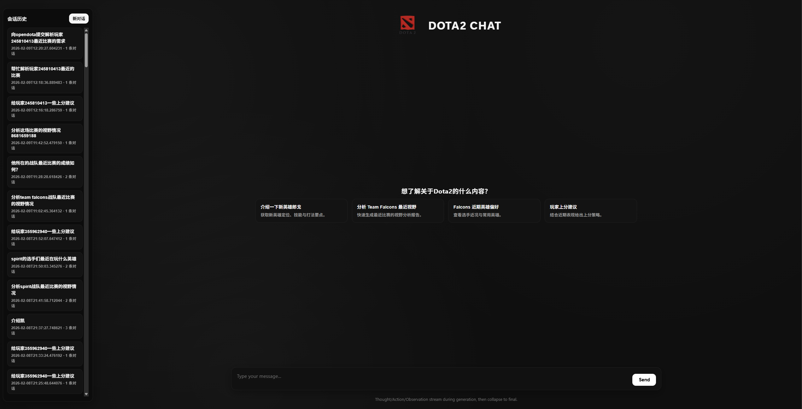
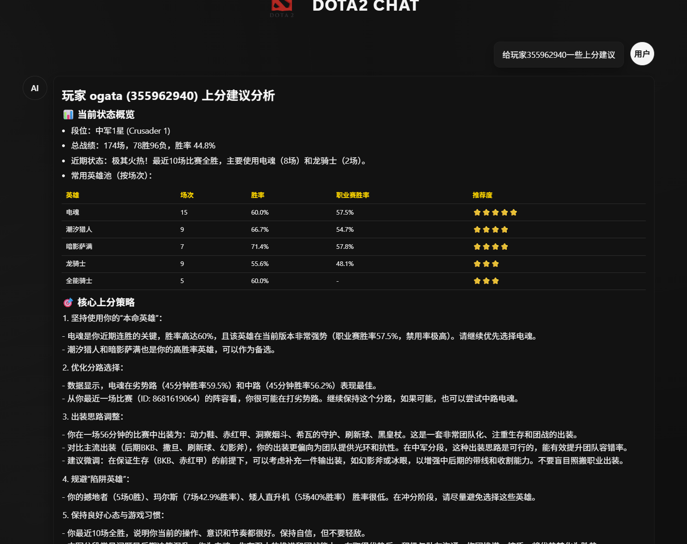
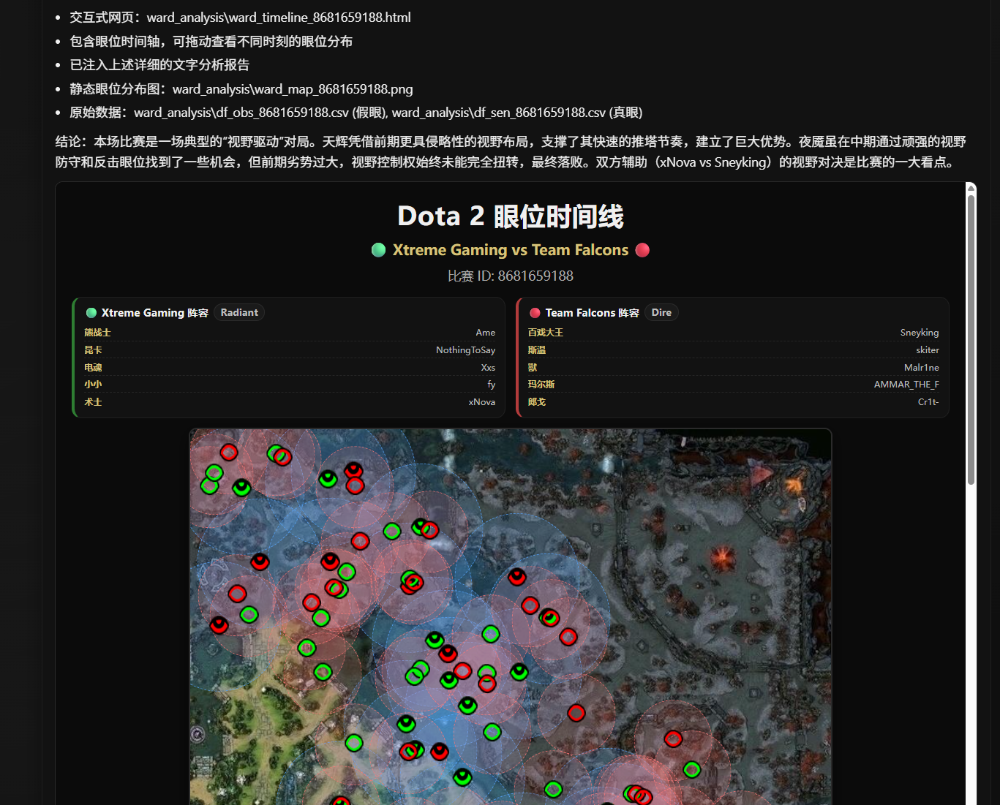
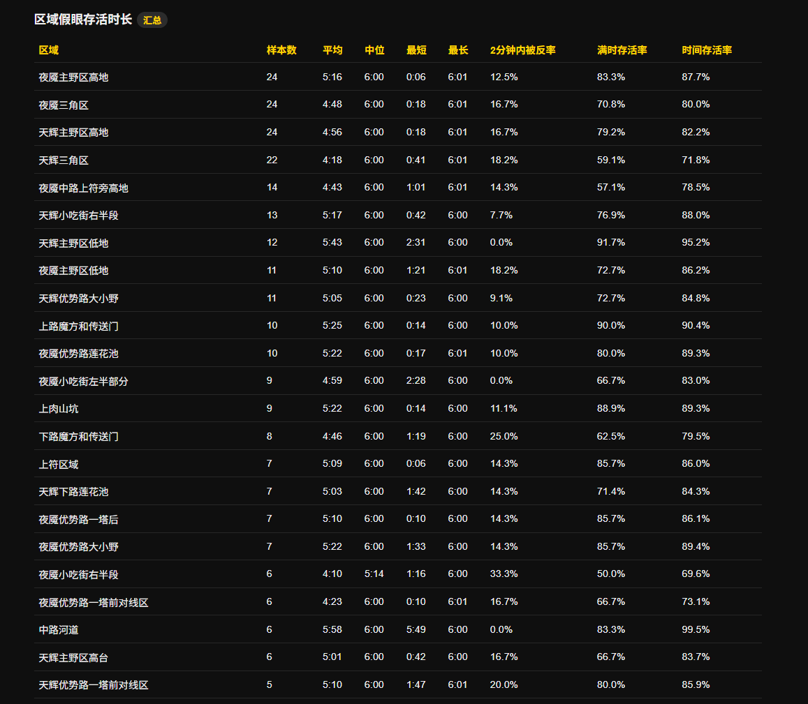
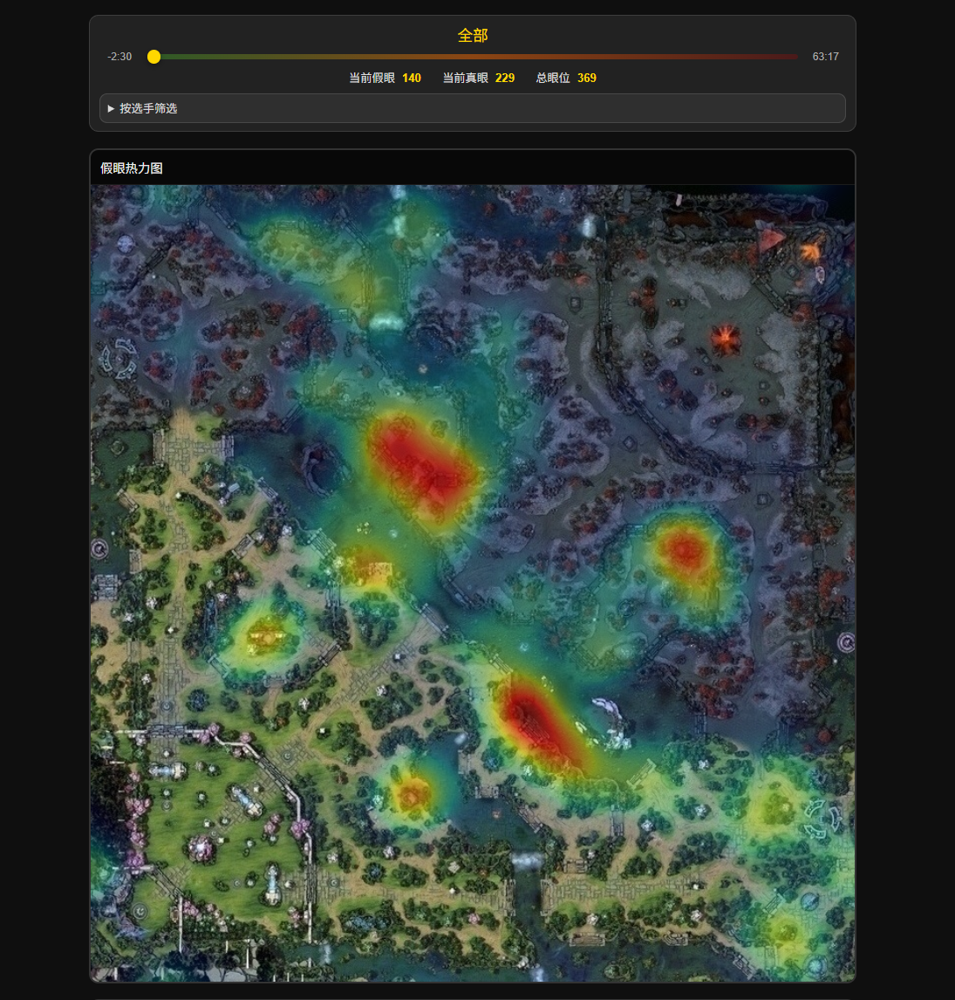
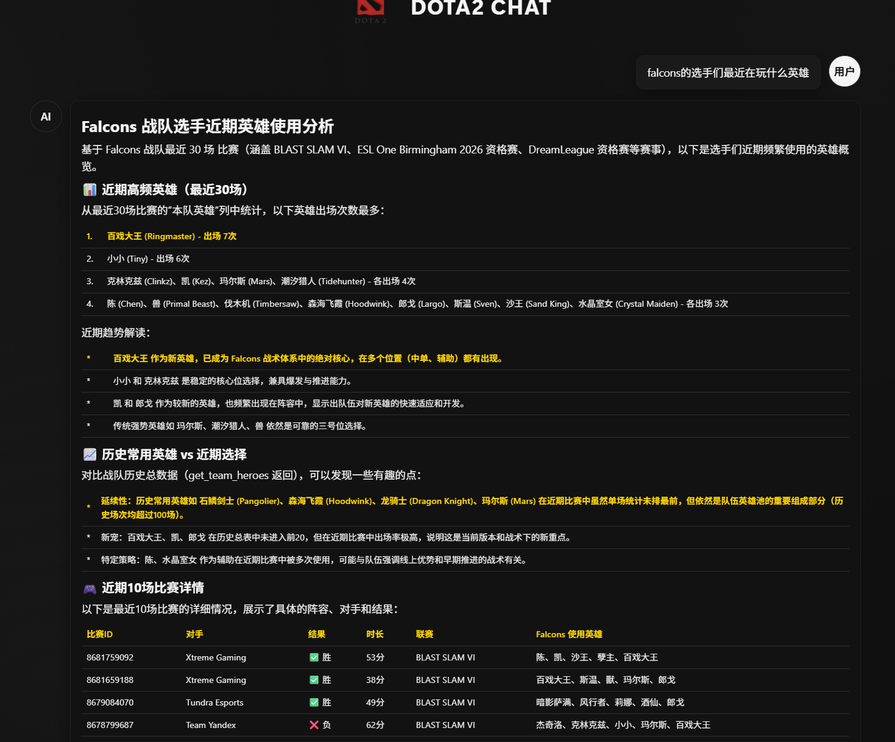
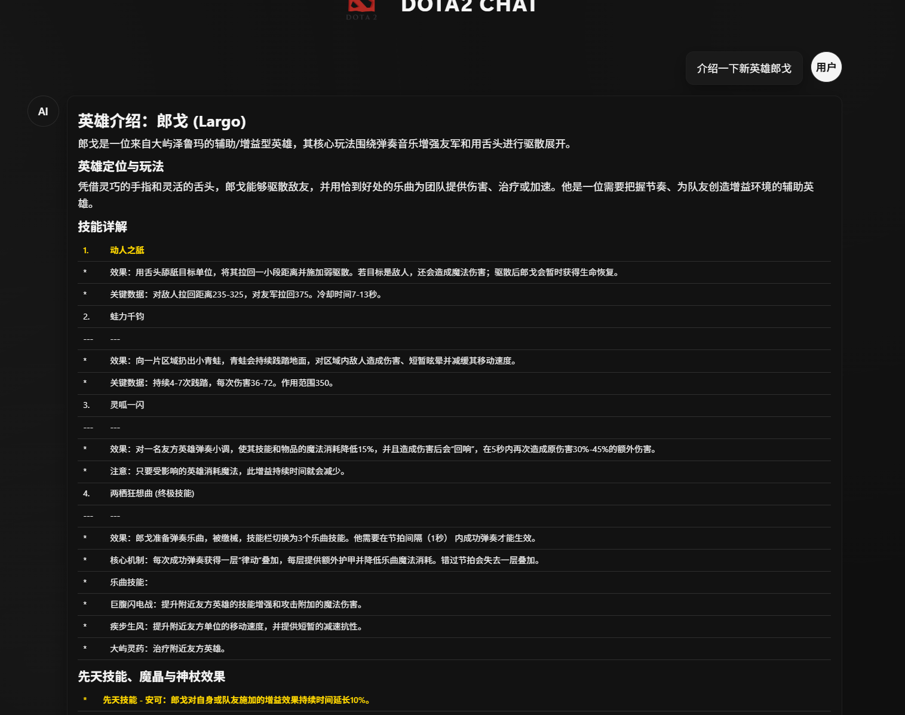

# Dota 2 ReAct Agent ⚔️

基于 ReAct 推理框架的 Dota 2 数据分析系统，内置 MCP 工具用于查询比赛、战队、选手、英雄与视野相关数据，并提供 Web UI 进行交互式分析与报告展示。

**系统介绍 🧭**

本系统由 ReAct Agent、MCP 工具服务与 Web UI 组成：Agent 负责“思考-行动-观察”的多步推理流程，MCP 以工具化方式封装 OpenDota 数据查询与分析能力，Web UI 提供实时对话、历史回放与报告展示。系统支持视野热力图、眼位分析、战队与英雄画像等结果输出，并可选接入 OpenViking 记忆模块以提升多轮对话的上下文理解。

**系统展示 🖼️**










**功能概览 ✨**

- ReAct 方式调用 MCP 工具完成多步分析
- 战队/比赛/选手/英雄数据查询与统计
- 视野热力图与分析报告生成
- Web UI 实时对话与历史会话回看

**快速开始 🚀**

1. 创建 Conda 环境

```bash
conda create -n dota2-agent python=3.10 -y
conda activate dota2-agent
```

2. 安装依赖

```bash
pip install -r requirements.txt
```

3. 配置环境变量
   在项目根目录创建 `.env`：

```bash
LLM_API_KEY="your_api_key"
LLM_BASE_URL="https://api.deepseek.com/v1"
LLM_MODEL_ID="deepseek-chat"
SERPAPI_API_KEY=your_serpapi_key
```

也可以申请有一点免费token额度的豆包 API 来替代 DeepSeek（示例）：

```bash
LLM_API_KEY="your_api_key"
LLM_MODEL_ID="doubao-seed-1-8-251228"
LLM_BASE_URL="https://ark.cn-beijing.volces.com/api/v3"
```

4. 配置 OpenViking（可选，默认启用记忆）

   - 编辑 ov.conf，填入你的 embedding / VLM 供应商与 API Key
   - 如需自定义路径，可设置 OPENVIKING_CONFIG_FILE 指向配置文件
   - 运行后自动生成 ov_data/

   ov.conf example (replace api_key):

```json
{
  "embedding": {
    "dense": {
      "api_base": "https://ark.cn-beijing.volces.com/api/v3",
      "api_key": "your_api_key",
      "provider": "volcengine",
      "dimension": 1024,
      "model": "doubao-embedding-vision-250615"
    }
  },
  "vlm": {
    "api_base": "https://ark.cn-beijing.volces.com/api/v3",
    "api_key": "your_api_key",
    "provider": "volcengine",
    "model": "doubao-seed-1-8-251228"
  }
}
```

5. 启动 Web 服务

```bash
python web_app.py
```

浏览器访问 `http://127.0.0.1:8000`。

**目录结构 📁**

```
hello_agents/
├─ mcp_server/            # MCP 工具集合
├─ prompts/               # ReAct 系统提示词
├─ web/                   # Web UI
├─ dota2_agent.py         # ReAct Agent 主程序
├─ web_app.py             # Web 服务入口
├─ requirements.txt
└─ logs/                  # 会话日志
```

**备注 📌**

- 数据来源：OpenDota API
- MCP 工具说明详见 `MCP_README.md`
